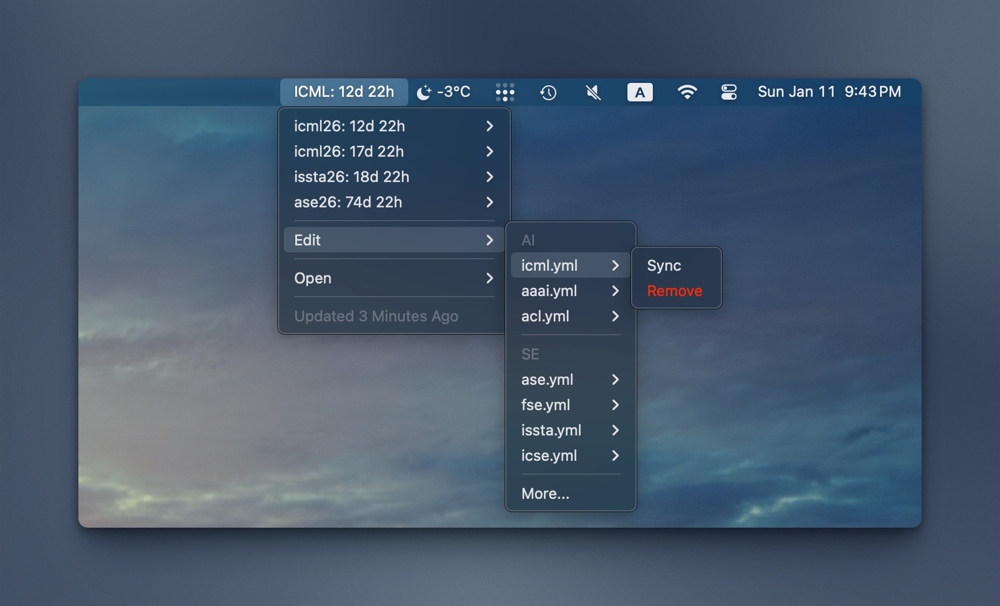

# CCFBar

[English](README.md) | 简体中文

你的 CCF 会议截稿追踪器，现已在 macOS 菜单栏上呈现！


## 功能

- ⏱️ 在菜单栏显示下一个即将到来的截稿
- 📋 列出所有未来截稿并显示倒计时
- 🌎 同时显示会议时区和你的本地时区
- 🔄 每小时自动更新
- 🛠️ 方便管理你关注的会议
- 🔗 提供会议网站链接



## 安装

### 快速安装

```bash
curl -fsSL https://github.com/superpung/swiftbar-ccfddl/releases/latest/download/install.sh | bash
```

### 手动安装

```bash
brew install --cask swiftbar
git clone https://github.com/superpung/swiftbar-ccfddl.git
cd swiftbar-ccfddl
chmod +x plugin/ccfbar.1h.py
python3 plugin/ccfbar.1h.py --init   # 生成 ~/.config/ccfbar/config.json
# 然后软链接到 SwiftBar 插件文件夹，并在 SwiftBar 中点 Refresh All：
ln -s "$(pwd)/plugin/ccfbar.1h.py" "$HOME/<你的-SwiftBar-插件文件夹>/ccfbar.1h.py"
```

然后将会议 YAML 文件添加到配置中的 `data_dir`，或者在本地仓库中运行 `bash install.sh`。

## 配置

CCFBar 读取以下配置文件：

```text
~/.config/ccfbar/config.json
```

设置 `CCFBAR_CONFIG` 可以使用不同的配置路径。参考 [config.example.json](config.example.json)。

```json
{
  "data_dir": "~/.config/ccfbar/conferences",
  "display": {
    "within_days": 365,
    "show_remaining_after_within_days": true
  },
  "sources": {
    "raw_base_url": "https://raw.githubusercontent.com/ccfddl/ccf-deadlines/refs/heads/main/conference",
    "conference_url": "https://github.com/ccfddl/ccf-deadlines/tree/main/conference"
  },
  "conferences": [
    "SE/icse.yml"
  ]
}
```

重要字段：

- `data_dir`：包含 ccfddl `.yml` / `.yaml` 文件的本地目录
- `display.within_days`：在归入 `More` 前，显示未来多少天内的截稿
- `sources.raw_base_url`：菜单中 `Sync` 操作使用的基础 URL
- `conferences`：安装脚本在数据目录为空时下载的初始文件

从 [ccfddl/ccf-deadlines](https://github.com/ccfddl/ccf-deadlines/tree/main/conference) 添加更多会议文件，然后刷新 SwiftBar。

`ccfbar.1h.py` 中的 `1h` 是 SwiftBar 刷新间隔。快速安装时，设置 `CCFBAR_REFRESH=10m` 可安装为 `ccfbar.10m.py`。

## 安装脚本选项

- `CCFBAR_REFRESH`：安装后的插件刷新间隔，默认 `1h`
- `CCFBAR_PLUGIN_URL`：覆盖插件下载 URL，用于测试
- `CCFBAR_CONFIG`：配置路径，默认 `~/.config/ccfbar/config.json`
- `CCFBAR_DATA_DIR`：数据目录覆盖项
- `CCFBAR_CONFERENCES`：空格分隔的初始会议文件，例如 `SE/icse.yml DB/sigmod.yml CV/cvpr.yml`

示例：

```bash
curl -fsSL https://github.com/superpung/swiftbar-ccfddl/releases/latest/download/install.sh \
  | CCFBAR_CONFERENCES="SE/icse.yml DB/sigmod.yml CV/cvpr.yml" bash
```

## 要求

- macOS
- [SwiftBar](https://github.com/swiftbar/SwiftBar)
- macOS 开发者工具自带或更新版本的 `python3`

## 致谢

- 数据来源：[CCF Deadlines](https://github.com/ccfddl/ccf-deadlines)
- 插件基于 [SwiftBar](https://github.com/swiftbar/SwiftBar)

## 许可证

[MIT](./LICENSE) License © 2025 [Super Lee](https://github.com/superpung)
